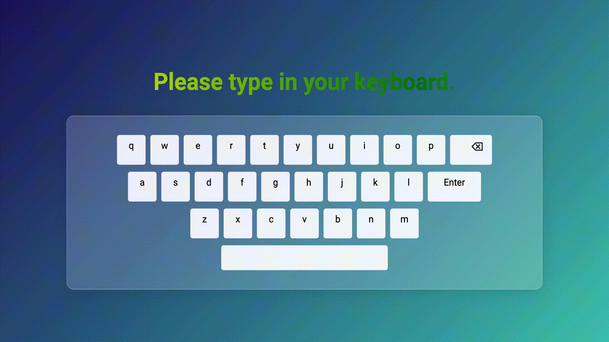
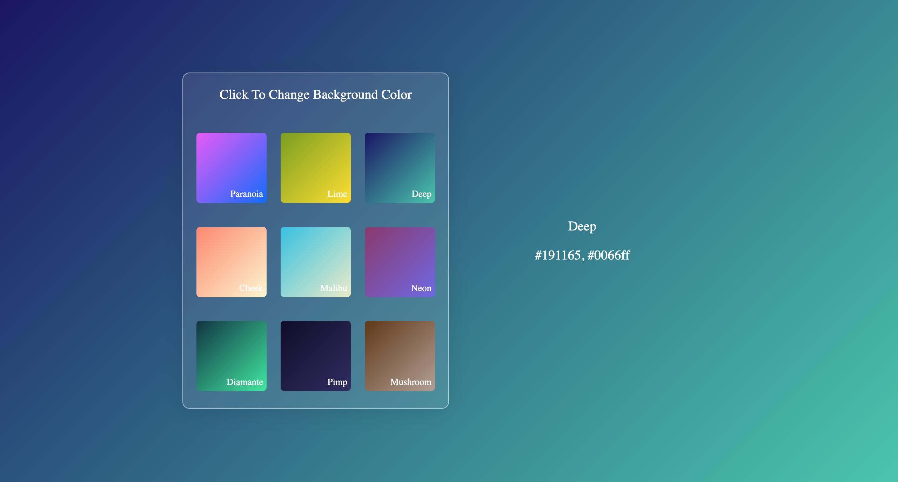
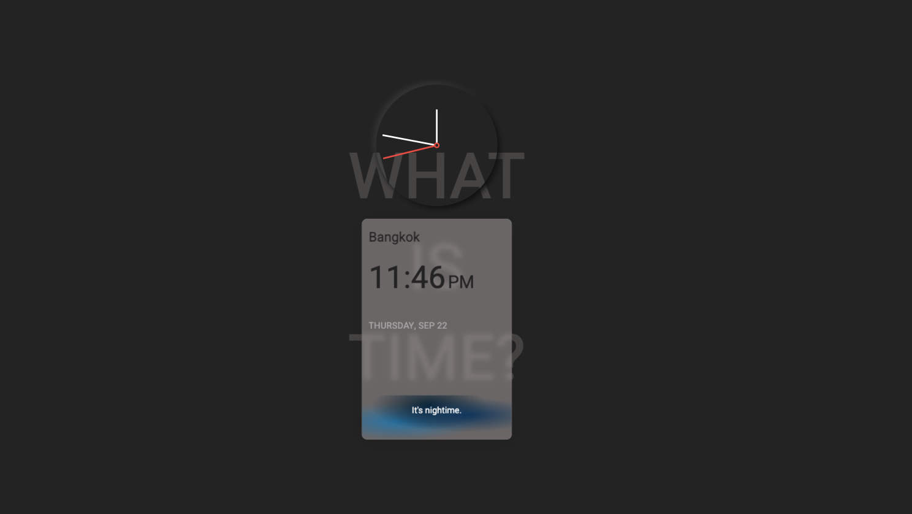

# Mini Javascript Projects

The projects here are created in order for me to study and get familiar with regular Javascript, as well as basic HTML and CSS at their most fundamental levels.

### Highlights

1. Keyboard Animation

   Live demo available at https://devjhom.github.io/keyboard-animation/



2. Change Background on Click

   Live demo available at https://devjhom.github.io/change-bg-onclick/



3. Time Clock

   Live demo available at https://devjhom.github.io/time-clock/



<br>
4. Loading Line

   Live demo available at https://devjhom.github.io/loading-line/

<br>
5. Mouse Tracker

   Live demo available at https://devjhom.github.io/mouse-tracker/
   
<br>
6. And many more yet to come...


<br>

## Getting Started
Clone this repository to your local machine.

1. To clone this repository
    ```sh
    git clone https://github.com/DevJhom/mini-js-projects.git
    ```
<br>

Most of the projects are inspired by Brad Traversy and Florin Pop's Udemy Course: "50 Projects In 50 Days".
https://www.udemy.com/course/50-projects-50-days/

Please feel free to share or use the source codes in your own personal projects.

